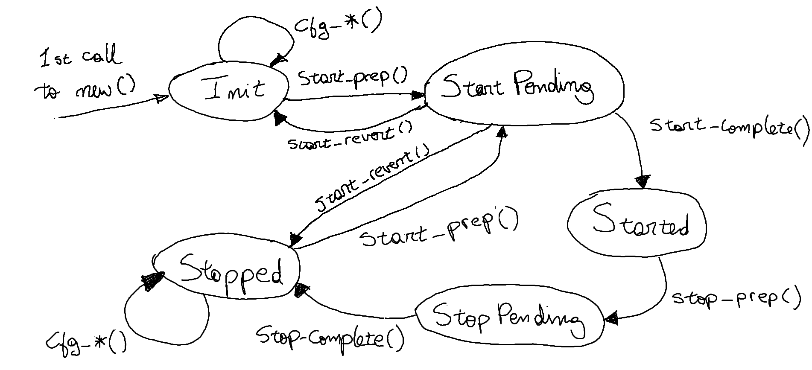

# amareleo-chain-api

The `amareleo-chain-api` crate provides the interface for Rust applications to programmatically control node instances.

## AmareleoApi

The `AmareleoApi` struct is the main object for interacting with the Amareleo node. It provides methods to configure, start and stop the node.

`AmareleoApi` is a singleton, which means that there can only be one instance per process. This results from a limitation in snarkVM that is described [here](https://github.com/kaxxa123/amareleo-chain/issues/19). 

It is possible to launch multiple nodes and run them in parallel from different processes. To do this one needs to avoid port conflicts and use different ledger storage directories.

`AmareleoApi` is driven by a state engine defined by the `AmareleoApiState` enumeration and depicted in the following diagram:

